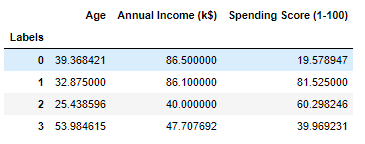

# Consumer Behaviour in the Mall: Cluster Analysis 
- I wanted to understand the customers who can be easily converge [Target Customers] so that the sense can be given to marketing team and plan the strategy accordingly.
- Optimized K-Means clustering method to reach the conclusion of the analysis.

# Code and Resources Used

**Python Version**: 3.7

**Packages**: pandas, numpy, sklearn, matplotlib, seaborn,json

**Data Resource**: https://www.kaggle.com/vjchoudhary7/customer-segmentation-tutorial-in-python

# [EDA](https://github.com/Jaspreetsm21/Mall_Customers/blob/main/EDA.ipynb)
  

### Insigth

# Cluster Analysis

In the plot above the elbow is at k=4. indicating the optimal k for this dataset is 4.

Cluster 0: Median Age - High Income with Low Spending Score.

Cluster 1: Median Age - High Income High with High Spending Score.

Cluster 2: Young Consumer - Low Income High with High Spending Score

Cluster 3: Older Consumer - Low Income with Low Spending Score

Cluster 1 would be the best segment to target, consumer with Higher Income and Higher spending Score.
